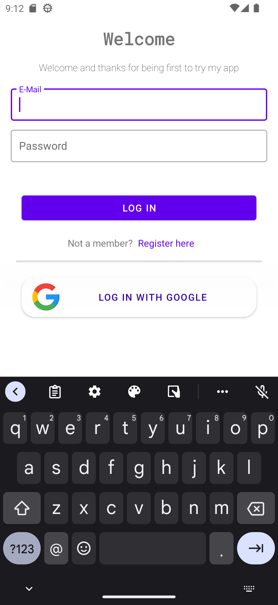

# Cloud Backend
Cloud Backend was my first firebase app it had login and register, ordering food and most importantly i was implemented multiple recycler views and also in kotlin so yeah i was so happy with it. It
just didn't have dark mode 🫣

# Things I Learned
- Kotlin
- XML
- Multiple RecyclerViews
- Firebase

# Screenshots
| Login                        | Register                        | Home                        | Food Item                          | Sorry                        |
|------------------------------|---------------------------------|-----------------------------|------------------------------------|------------------------------|
|  |  |  |  |  |

# Thank You
And thank you coming by, this app had my many firsts and i was also very happy with the ui too this app is pretty special to me. Thank You again for coming by to this old repo hope you have a good day :) 